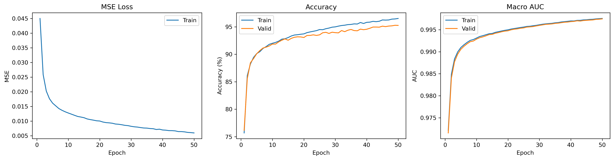
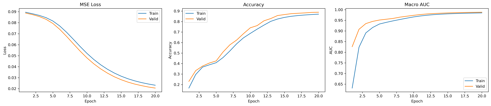

# Neural Network Performance Report: Custom ANN vs Keras Implementation

This report evaluates the performance of three Artificial Neural Network (ANN) approaches on the MNIST handwritten digit classification task: a single-layer ANN, a custom multilayer ANN implemented solely with NumPy `NeuralNetMLP`, and a Keras-based ANN.

**Note: AUC is macro AUC.**

---

## Project Overview

### Objective
The goal of this assignment is to:
- Implement a multi-layer Artificial Neural Network from scratch using NumPy
- Build an equivalent neural network using Keras/TensorFlow
- Compare the predictive performance of both implementations on the MNIST dataset

### Dataset
- **Dataset**: MNIST (Modified National Institute of Standards and Technology)
- **Task**: Multi-class classification (10 digits: 0-9)
- **Features**: 784 (28×28 pixel images flattened)
- **Total Samples**: 70,000 images

### Data Preprocessing
- Normalized pixel values from [0, 255] to [-1, 1] range using: $X_{norm} = (\frac{X}{255} - 0.5) \times 2$
- Applied stratified sampling to maintain class distribution across train/validation/test splits

---

## Step 1: Reading and Understanding the Theory

The implementation is based on **Chapter 11: Implementing a Multi-layer Artificial Neural Network from Scratch** from the textbook "Machine Learning with PyTorch and Scikit-Learn" by Raschka et al. (2022).

Key concepts covered:
- Forward propagation through multiple layers
- Backpropagation algorithm for gradient computation
- Activation functions (sigmoid, softmax)
- Loss functions (Mean Squared Error)
- Batch-based training with minibatches

---

## Step 2: Implementing Multilayer ANN Using only *NumPy* 

Extend the ch11.ipynb code to address two hidden layers.

The `NeuralNetMLP` class implements a complete multilayer neural network **using only NumPy and Python**. It handles forward propagation, backpropagation, minibatch training, and inference, managing all weights, biases, activations, and training metrics internally.

### Architecture Overview

The custom implementation defines a multi-layer perceptron with:
- **Input Layer**: 784 neurons (flattened MNIST images)
- **Hidden Layers**: 2 layers with 500 units each
- **Output Layer**: 10 neurons (one per digit class)
- **Total Architecture**: 784 → 500 → 500 → 10
- Activation functions: Sigmoid (hidden), Softmax (output)

### NeuralNetMLP Class

The `NeuralNetMLP` class defines the structure and training process of a multi-layer neural network using three main inputs: `num_features`, `hidden_layers`, and `num_classes`. The `num_features` parameter determines the dimensionality of the input layer and corresponds to the number of features in the data. The `hidden_layers` parameter is a list whose length can be chosen arbitrarily, allowing the network to include as many hidden layers as needed, while each element specifies the number of neurons in the corresponding layer. The `num_classes` parameter defines the size of the output layer and represents the number of target classes. During the forward pass, input features are successively transformed through all hidden layers and mapped to an output vector of length `num_classes`. During training, this structure use backpropagation to compute gradients for every layer, enabling parameter updates based on the prediction error.

## Step 3: Performance Evaluation

Apply the code of step on 2, `NeuralNetMLP`, for classifying handwritten digits using MNIST dataset. 

#### Training

The custom ANN was trained using stochastic gradient descent (SGD) with minibatches of 100 samples over 20 epochs.

*Figure 1: `NeuralNetMLP` metrics progression across training epochs*  

 
 

**Training Configuration**:
- Learning rate: 0.1
- Batch size: 100
- Total epochs: 20

 
 

Data Split | Metric   | NeuralNetMLP |
-----------|----------|--------------|
Train      | MSE      | 0.0059       |
Train      | Accuracy | 96.52%       |
Train      | AUC      | 0.9975       |

 
 

Data Split | Metric   | NeuralNetMLP |
-----------|----------|--------------|
Validation | Accuracy | 95.26%       |
Validation | AUC      | 0.9975       |

 
 

### Performance Results

Data Split | Metric    | NeuralNetMLP     |
-----------|-----------|------------------|
Test       |  Accuracy | 95.25%           |
Test       |  AUC      | 0.9969           |

---

## Step 3 Keras Implementation

### Architecture Overview

**Configuration**:
- **Optimizer**: SGD (learning_rate=0.1)
- **Loss Function**: Mean Squared Error (MSE)
- **Metrics**: Accuracy
- **Batch Size**: 100
- **Epochs**: 20
- **Validation Split**: 0.2

#### Training

*Figure 2: `Keras` metrics progression across training epochs*  

**Training Configuration**:
- Learning rate: 0.1
- Batch size: 100
- Total epochs: 20

Data Split | Metric    | Keras ANN |
-----------|-----------|-----------|
Validation |  Accuracy | 88.89%    |
Validation |  AUC      | 0.9882    |

### Keras Model Performance

Data Split | Metric   | Keras ANN |
-----------|----------|-----------|
Test       | Accuracy | 87.51%    |
Test       |  AUC     | 0.9855    |

---

## Step 4 Comparative Analysis

| Aspect          | Singel Layer ANN | NeuralNetMLP | Keras  | 
|-----------------|------------------|--------------|--------|
| Test Accuracy   |  94.54%          | 95.25%       | 87.51% |
| Test AUC        |  *Nan*           | 0.9969       | 0.9855 |
| Training Speed  |  Moderate        | Moderate     | Fast   |
| Code Complexity | High             | High         | Low    | 

The table highlights clear trade-offs between the three ANN implementations. The Single Layer ANN provides a strong baseline performance with high accuracy but lacks probabilistic quality measures such as AUC, limiting deeper evaluation. The NeuralNetMLP achieves the best overall performance, delivering the highest test accuracy and AUC, which indicates superior representation capacity and generalization at the cost of higher implementation complexity and moderate training speed. In contrast, the Keras model offers the fastest training and lowest code complexity, making it more practical and scalable, but with slightly reduced predictive performance compared to the custom NumPy-based MLP. Overall, the results demonstrate that increased architectural depth and custom control can yield better performance, while high-level frameworks prioritize efficiency and usability.

