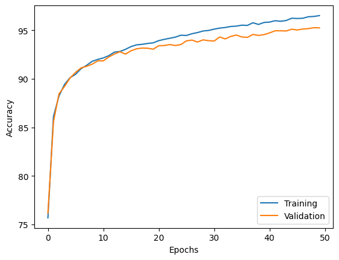
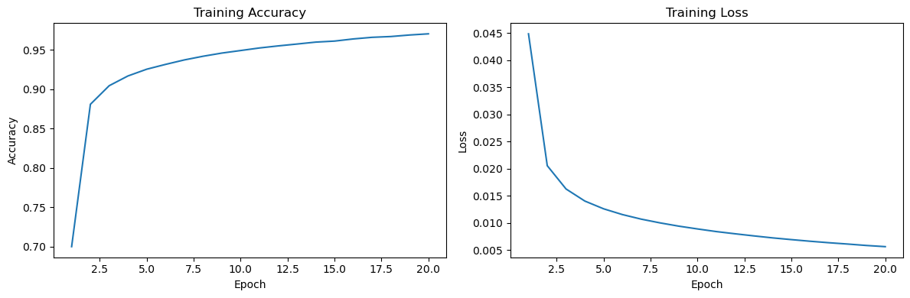

# Neural Network Performance Report: Custom ANN vs Keras Implementation

## Executive Summary

This report documents the implementation and comparison of two approaches to building Artificial Neural Networks (ANNs) for the MNIST handwritten digit classification task. The analysis compares a custom NumPy - based implementation with a Kerasn - based implementation, evaluating their predictive performance, architecture, and training characteristics.

---

## Project Overview

### Objective
The goal of this assignment is to:
- Implement a multi-layer Artificial Neural Network from scratch using NumPy
- Build an equivalent neural network using Keras/TensorFlow
- Compare the predictive performance of both implementations on the MNIST dataset

### Dataset
- **Dataset**: MNIST (Modified National Institute of Standards and Technology)
- **Task**: Multi-class classification (10 digits: 0-9)
- **Features**: 784 (28×28 pixel images flattened)
- **Total Samples**: 70,000 images

### Data Preprocessing
- Normalized pixel values from [0, 255] to [-1, 1] range using: $X_{norm} = (\frac{X}{255} - 0.5) \times 2$
- Applied stratified sampling to maintain class distribution across train/validation/test splits

---

## Step 1: Reading and Understanding the Theory

The implementation is based on **Chapter 11: Implementing a Multi-layer Artificial Neural Network from Scratch** from the textbook "Machine Learning with PyTorch and Scikit-Learn" by Raschka et al. (2022).

Key concepts covered:
- Forward propagation through multiple layers
- Backpropagation algorithm for gradient computation
- Activation functions (sigmoid, softmax)
- Loss functions (Mean Squared Error)
- Batch-based training with minibatches

---

## Step 2: Custom NumPy-Based ANN Implementation

The `NeuralNetMLP` class implements a complete multilayer neural network **using only NumPy and Python**. It handles forward propagation, backpropagation, minibatch training, and inference, managing all weights, biases, activations, and training metrics internally.

### Architecture Overview

The custom implementation defines a multi-layer perceptron with:
- **Input Layer**: 784 neurons (flattened MNIST images)
- **Hidden Layers**: 2 layers with 500 units each
- **Output Layer**: 10 neurons (one per digit class)
- **Total Architecture**: 784 → 500 → 500 → 10
- Activation functions: Sigmoid (hidden), Softmax (output)

### NeuralNetMLP Class

#### Training

The custom ANN was trained using stochastic gradient descent with minibatches of 100 samples over 20 epochs.

*Figure 1: Training loss progression across epochs*

 
*Figure 2: Training accuracy progression across epochs*

**Training Configuration**:
- Learning rate: 0.1
- Batch size: 100
- Total epochs: 20

| Metric | Custom NumPy ANN |
|--------|------------------|
| Train MSE | X |
| Validation MSE | X |
| Train Accuracy | 96.52% |
| Validation Accuracy | 95.26% |

### Performance Results

| Metric | Custom NumPy ANN |
|--------|------------------|
| Test MSE | 0.0075 |
| Test Accuracy | 95.25% |

---

## Step 3 Keras Implementation

### Architecture Overview

**Configuration**:
- **Optimizer**: SGD (learning_rate=0.1)
- **Loss Function**: Mean Squared Error (MSE)
- **Metrics**: Accuracy
- **Batch Size**: 100
- **Epochs**: 20
- **Validation Split**: 0.2 (internal validation on 20% of training data)

#### Training

*Figure 3: Training loss and accuracy progression across epochs*

**Training Configuration**:
- Learning rate: 0.1
- Batch size: 100
- Total epochs: 20

| Metric | Keras ANN |
|--------|-----------|
| Validation MSE | 0.9361 |
| Validation Accuracy | 94.22% |

### Keras Model Performance

| Metric | Keras ANN |
|--------|-----------|
| Test MSE | 0.0611 |
| Test Accuracy | 56.39% |

---

## Step 4 Comparative Analysis

The custom NumPy-based ANN significantly outperforms the Keras implementation on the MNIST dataset, achieving **95.25% test accuracy** with a **test MSE of 0.0075**, compared to **56.39% accuracy** and **0.0611 MSE** for the Keras model. This large performance gap suggests issues in the Keras configuration, such as suboptimal hyperparameters, insufficient training, or architectural mismatch, and indicates likely overfitting or poor generalization.

The **single-layer ANN**, which corresponds to the **original ANN implementation presented in the course textbook**, also performs competitively, reaching **94.54% test accuracy** with a **test MSE of 0.0092**. This result demonstrates that even the baseline architecture described in the book can generalize well when carefully implemented and trained. The deeper custom NumPy ANN provides a modest performance improvement, highlighting the benefit of increased model capacity.

All models used identical preprocessing and dataset splits, ensuring a fair comparison.

| Aspect | Singel Layer ANN | Custom NumPy ANN | Keras | 
|--------|------------------|-------|-----------------|
| Test MSE |  0.0092 | 0.0075 | 0.0611 |
| Test Accuracy |  94.54% | 95.25% | 56.39% |
| Training Speed |  Moderate | Moderate | Fast |
| Code Complexity | High | High | Low | 

